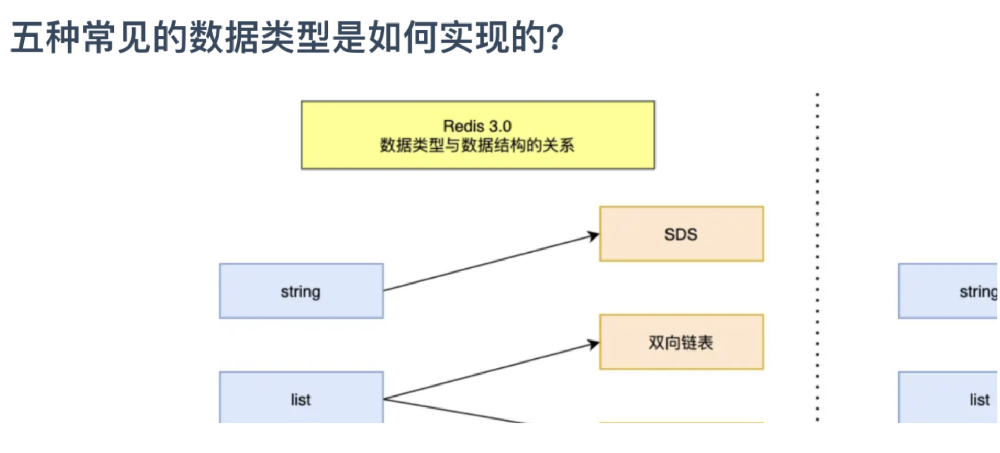

# test2

## test2

### test2

basic footnote[^1]
here is an inline footnote[^2](inline footnote)
and another one[^3]
and another one[^4]

[^1]: basic footnote content
[^3]: paragraph
footnote
content

[^4]: footnote content with some [markdown](https://en.wikipedia.org/wiki/Markdown)