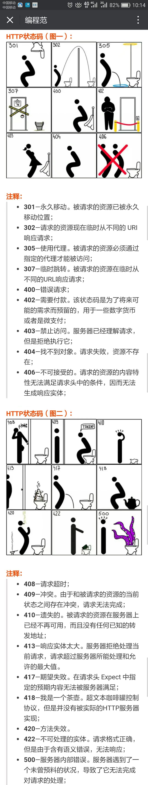


内容包括：
1. HTTP 协议
2. GET 与 POST
3. HTTP 缓存
4. HTTP 特性


---

# HTTP 基本概念

## HTTP 协议介绍

HTTP——超文本传输协议（**H**yperText **T**ransfer **P**rotocol）。

HTTP 主要用来规范浏览器和服务器端（也可以是服务器端和服务器端）的行为的，是专门用来在**两点之间传输数据**的约定和规范。

HTTP 传输的内容是「超文本」。所谓超文本，就是网络上的包括文本在内的各种信息，比如：文字、图片、视频、超链接……

因此，换成更专业的说法：
**HTTP 是一个在计算机世界里专门在「两点」之间「传输」文字、图片、视频等「超文本」数据的「约定和规范」。**

## HTTP 常见的状态码

# 状态码

